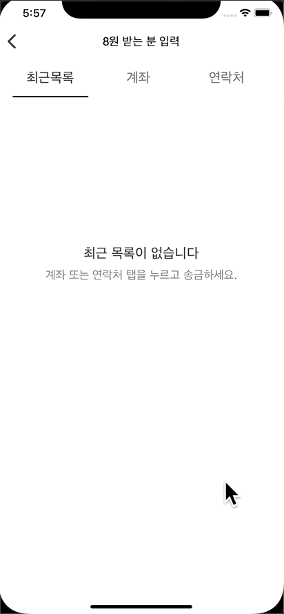
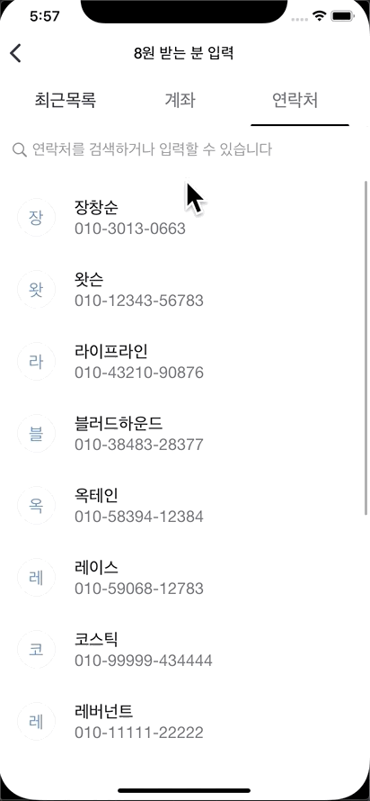

# 토스 송금 기능 구현 앱

토스 앱의 송금 기능을 구현한 앱

## 앱 화면

## 애니메이션

#### 금액이 0원일 때 자동이체, 송금 버튼과 취소, 지우기 버튼 비활성화   
   

#### 200만 원이 넘는 금액 입력 시, 금액 레이블에 애니메이션 효과가 나타나고, 레이블 하단에 200만 원으로 수정할 수 있는 버튼 활성화 
   

#### 페이지를 스크롤 하면 0.3초 뒤 메뉴바 하단의 라인이 해당 페이지의 메뉴로 이동 (실제 토스 앱처럼 구현)
   

#### 메뉴를 직접 선택 시 메뉴바 하단의 라인이 즉시 해당 페이지의 메뉴로 이동 (실제 토스 앱처럼 구현)
   

#### ‘계좌번호 입력’ 텍스트 필드 터치 시 텍스트 필드 하단에 파란색 라인이 애니메이트, 숫자 입력 시 ‘계좌번호 입력’ 레이블이 상단으로 이동되며,
#### 텍스트 필드 외부 터치 시 파란색 라인 사라지는 애니메이트   
   

## 사용된 기술 
- MVC 패턴 
- 100% 코드로 UI 구현 
- Snapkit으로 오토 레이아웃 구현
- Snapkit의 Constraints 업데이트를 이용해 애니메이션 구현
- 금액 입력 화면에서 KVO를 이용해 Number 모델의 프로퍼티를 감시하고, 프로퍼티의 변경이 감지되면 뷰를 업데이트 및 버튼 활성/비활성화

